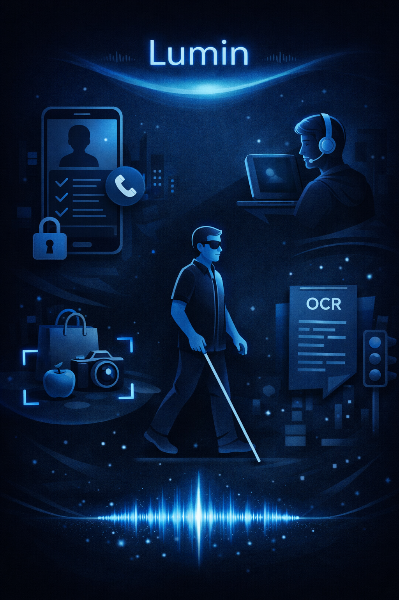
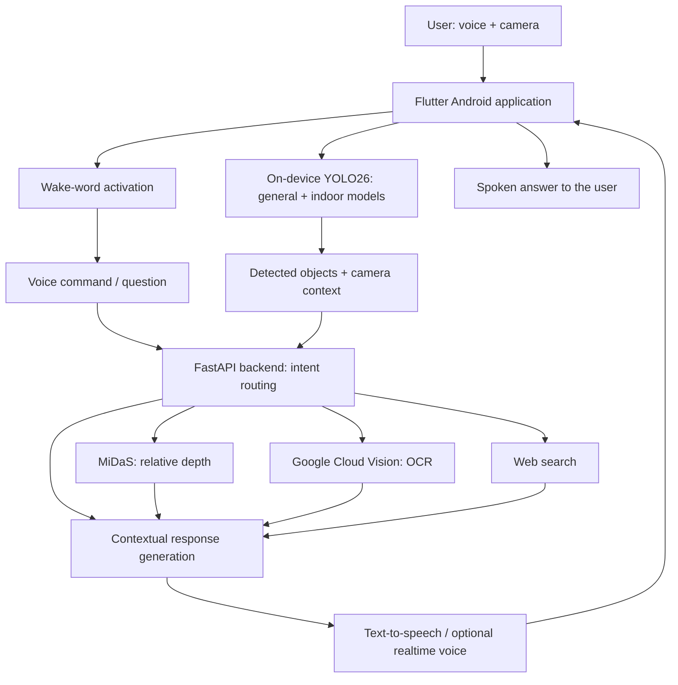
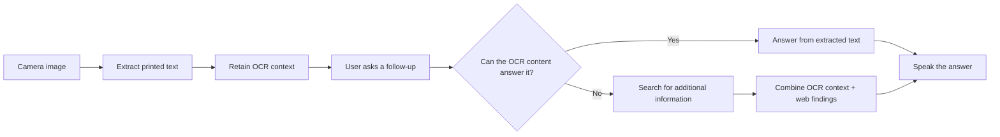

<div align="center">



# LUMIN

**An AI-powered voice assistant that helps blind and visually impaired users understand and interact with their surroundings.**


**Object detection · Relative depth · Intelligent OCR · Voice interaction · Web search**

[Explore the demo](#demo--project-materials) · [See the screenshots](#lumin-in-action) · [Understand the architecture](#how-it-works)· [Meet the team](#the-team)

</div>

---

## A graduation project with a purpose

Everyday spaces contain information that many people take in at a glance: a chair in the way, a switch on a wall, a label on a package, or a line of text on a document. For blind and visually impaired users, accessing that information can require assistance or several separate tools.

**LUMIN brings visual perception, text understanding, and spoken conversation into one mobile experience.** Point the camera, ask a question, and receive a concise spoken response. The assistant connects what the camera sees with what the user wants to know, including follow-up questions that require information from the web.

Developed as a **2025–2026 graduation project at Cairo University**, LUMIN combines applied AI with an accessibility-focused mobile experience.

## What LUMIN can do

| Capability | What it brings to the user | Implementation |
|---|---|---|
| **Understand surroundings** | Identify objects in the live camera view and ask questions about the scene. | General-purpose YOLO26 detection alongside a custom indoor model. |
| **Describe proximity** | Add descriptions such as “very close,” “close,” or “far” to detected objects. | MiDaS relative depth estimation through the backend. |
| **Read and understand text** | Read documents, signs, labels, and packaging, then turn the extracted text into useful spoken information. | Google Cloud Vision OCR with contextual language-model processing. |
| **Talk naturally** | Use voice commands to choose features and ask questions, with spoken responses. | Speech transcription, intent routing, text-to-speech, and optional realtime voice. |
| **Search the web** | Ask questions that need information beyond the camera or extracted text. | Web search with concise conversational answers and source citations. |
| **Continue an OCR conversation** | Ask follow-up questions about scanned text without manually changing features. | A context router chooses an OCR-based answer or an additional web search. |

The voice prompts are designed around **Egyptian Arabic**, with an Android wake-word service and a custom **“Lumen”** keyword asset.

## Demo & project materials

**Start with the demonstration, then explore the full design and evaluation.**

| Material | Explore |
|---|---|
| **Project demonstration** | [Watch / download the LUMIN demo](Demo/Graduation%20Project%20Demo%28Lumin%29.mp4) |
| **graduation report** | [Read the full project report](Document%26poster/Graduation%20Project%20Report.pdf) |
| **Project poster** | [View the poster](Document%26poster/Poster.pdf) |
| **Model training notebook** | [Explore the YOLO fine-tuning workflow](Training/yolo_finetuning/trainyolo.ipynb) |


## LUMIN in action

Actual application screenshots from the project demonstration and testing.

### Visual awareness: general objects and Egyptian home interiors

<table>
  <tr>
    <td align="center" width="50%"><br/><strong>General-purpose object detection</strong></td>
    <td align="center" width="50%"><br/><strong>Custom indoor detection with proximity</strong></td>
  </tr>
</table>

### Read text, then ask about it

<table>
  <tr>
    <td align="center" width="50%"><br/><strong>Camera-based text reading</strong></td>
    <td align="center" width="50%"><br/><strong>Contextual OCR responses</strong></td>
  </tr>
</table>

### Take the conversation further

<table>
  <tr>
    <td align="center" width="50%"><br/><strong>OCR + web search</strong></td>
    <td align="center" width="50%"><br/><strong>Conversational web search</strong></td>
  </tr>
</table>

<details>
<summary><strong>More application screenshots</strong></summary>

<p align="center"></p>


</details>

## How it works

LUMIN combines **on-device object detection** with a **cloud-assisted Python backend**. Flutter handles the camera and user interaction; FastAPI connects speech, OCR, reasoning, web search, and depth estimation.



### OCR that supports a conversation

Reading text is only the first step. LUMIN keeps the extracted content available so the user can ask a follow-up question. The backend decides whether that content is enough or whether the answer needs external information.



Illustrative interaction flows:

- **Scene awareness:** ask what is nearby → detect visible objects → estimate relative proximity → describe the scene aloud.
- **Document understanding:** scan printed text → receive a useful response → ask a question about that text.
- **Connected follow-up:** scan a package → ask for information beyond its printed label → route the question to web search while retaining the OCR context.

## A model built for local surroundings

Generic object categories do not cover every detail of a home. LUMIN adds a custom **26-class indoor dataset**, curated using Roboflow with objects commonly found in Egyptian homes, to complement general-purpose detection.

The included training notebook starts from pretrained **YOLO26s** weights and uses transfer learning. Its configured training settings include:

| Setting | Notebook configuration |
|---|---|
| Input size | 640 × 640 |
| Maximum epochs | 60, with early-stopping patience of 10 |
| Batch size | 16 |
| Optimizer | AdamW |
| Initial learning rate | 0.0005 |
| Frozen layers | First 10 layers |
| Weight decay | 0.01 |

The mobile application references TensorFlow Lite exports for both the general model and the custom indoor model. The notebook also includes label cleanup and class-distribution inspection.

<details>
<summary><strong>Explore the 26 custom indoor classes</strong></summary>

`Desk` · `Plate` · `bandage` · `carpet` · `curtain` · `door` · `door_handle` · `drawer` · `fan` · `glasses` · `head_phones` · `heater` · `lamp` · `light_switch` · `mirror` · `pillow` · `plastic_bag` · `pot` · `shelf` · `socket` · `table` · `tissue` · `towel` · `washing_machine` · `wheelchair` · `window`

See the [class list](Training/yolo_finetuning/classes.txt) and [dataset configuration](Training/yolo_finetuning/dataset.yaml). Dataset access and local paths must be configured for your training environment.

</details>

## Technology stack

| Layer | Technologies |
|---|---|
| Mobile experience | Flutter, Dart, Android native Kotlin integration |
| Object detection | Ultralytics YOLO26, custom indoor fine-tuning, TensorFlow Lite |
| Relative depth | MiDaS small model, LiteRT backend inference |
| Text extraction | Google Cloud Vision OCR |
| Voice activation | Picovoice Porcupine, custom wake-word asset |
| Speech & conversation | Native speech integration, Flutter TTS, OpenAI transcription/TTS, Edge TTS |
| Optional realtime voice | OpenAI Realtime with WebRTC |
| Reasoning & search | OpenAI-backed response generation, tool routing, web search |
| Backend | Python, FastAPI, HTTPX, Uvicorn |
| Training | Roboflow, Ultralytics, Google Colab notebook |

## Repository structure

```text
Lumin/
├── app/                       Flutter application and platform projects
│   ├── assets/                YOLO models, wake-word asset, artwork
│   └── lib/
│       ├── screens/           Home, detection, OCR, search, setup, metrics
│       ├── services/          Depth, performance metrics, setup state
│       ├── realtime/          Realtime voice integration
│       └── wakeword/          Porcupine integration
├── backend/
│   ├── main.py                FastAPI routes and AI integrations
│   ├── models/                MiDaS TensorFlow Lite model
│   ├── prompts/               System, tool, fallback, example prompts
│   └── tests/                 Prompt-loader tests
├── Training/
│   ├── yolo_finetuning/       Notebook, dataset configuration, classes
│   └── Depth_Estimation/      Depth-estimation development script
├── Demo/                      Graduation demo video (Git LFS)
├── Document&poster/           Report, poster, application screenshots
└── docs/assets/               README front-page artwork
```


## Backend API at a glance

| Endpoint | Purpose |
|---|---|
| `GET /health` | Backend status and configured model information |
| `POST /route-home-command` | Route a spoken command to an application feature |
| `POST /ask` | Answer a question with available visual context |
| `POST /ask-voice` | Generate an answer with audio output |
| `POST /transcribe` | Transcribe user audio |
| `POST /read-text` | Extract and interpret text from an image |
| `POST /read-text/question` | Answer OCR follow-ups or route to web search |
| `POST /web-search` | Generate a web-assisted answer with citations |
| `POST /depth/midas` | Estimate relative proximity for supplied object boxes |
| `POST /tts-edge`, `POST /tts-openai` | Convert response text into audio |
| `POST /realtime/session`, `POST /realtime/client-secret` | Support realtime voice session setup |

## Evaluation and practical limits

The [graduation report](Document%26poster/Graduation%20Project%20Report.pdf) documents the architecture, requirements, functional test cases, project evaluation, and future work. Its testing discussion identifies reduced OCR performance under poor lighting or blur, and reduced speech-transcription accuracy with background noise.

- **Relative proximity:** MiDaS provides relative depth cues, not calibrated distances in metres.
- **Cloud connectivity:** OCR, web search, and cloud voice/reasoning features require network access and configured services. On-device detection is one part of the complete experience.
- **Environmental conditions:** lighting, camera framing, occlusion, and background noise affect the available information.
- **Assistive scope:** LUMIN is a graduation-project prototype for environmental awareness; its outputs should not be treated as guaranteed obstacle avoidance or independent navigation guidance.
- **Data flow:** camera images, extracted text, and audio may be sent to the configured cloud providers depending on the selected feature.

## The team

**Cairo University · Faculty of Computers and Artificial Intelligence · Department of Data Science**  
**Academic year: 2025–2026**

| Team member |
|---|
| Farida Hamid Mohamed |
| Abdulrahman Gamal |
| Mariam Mohsen Amin |
| Salma Abdelhalim Eid |

**Project supervisor:** Dr. Ali Zidane.


<div align="center">

**LUMIN — making visual information accessible through conversation.**

Built as a graduation project. Driven by accessibility.

### Graduation recognition


Awarded **200/200 and an A+** in the graduation project assessment at **Cairo University**.

</div>
